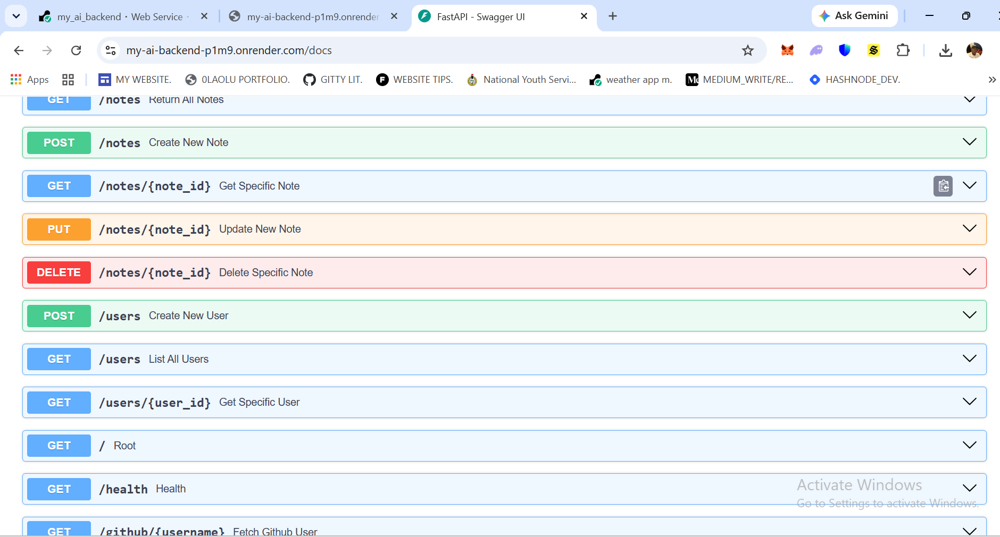

# AI Backend —> Notes API, FastAPI (pydantic) + Claude AI Integration: 
A notes app that is powered by FastAPI and pydantic's verification and formatting models (BaseSettings & BaseModel), built on CRUD principle; it allows users to create, read, update or delete notes through these various endpoints, live AI chat endpoint powered by Claude-sonnet 4.6, GitHub user look-up, CORS middleware, API_Key authentication and request logging (method, path, status_code & duration) using loguru.

## What it does: 
At its core, it uses CRUD [CREATE - READ - UPDATE - DELETE]. "CREATE" under a 'POST' endpoint allows the user to create a note with the 'title' and 'content' while an 'ID' is automatically assigned to the note, "READ" under a 'GET' endpoint allows the user to retrieve note/notes content; either returning a specific note with the 'note_id' or returning all existing note through a python list, an "UPDATE" under a 'PUT' endpoint that allows you to update (change) the 'title', 'content' or both of a note while the note retains its ID and a "DELETE" under a 'DELETE' endpoint that allows the user to delete a note by using the specific 'note_id', it also allows you to make AI calls to the anthropic API and also look-up GitHub accounts with username provided to retrieve 'login (username), name, number of followers and public_repos.'
 
## Tech Stack: 
Python 3.12, FastAPI 0.100+, Pydantic v2, Anthropic Claude Sonnet 4.6 and Loguru.

## How to run it locally:
1. Clone the repository
   git clone https://github.com/dynamzee/ai-backend.git
   cd ai-backend

2. Create and activate virtual environment:
   python -m venv venv
   venv\Scripts\Activate.ps1

3. Install dependencies:
   pip install -r requirements.txt

4. Create your own .env file:
   Copy .env.example to .env and fill in your values.

5. Run the server:
   uvicorn main:app --reload

6. Check and test endpoints:
   Visit http://127.0.0.1:8000/docs

## API Endpoints: 
| Method | Endpoint | Description |
|--------|----------|-------------|
| POST | /notes | Create a new note |
| GET | /notes | Get all notes |
| GET | /notes/{note_id} | Get a specific note |
| PUT | /notes/{note_id} | Update a note |
| DELETE | /notes/{note_id} | Delete a note |
| GET | /github/{username} | Fetch GitHub user info |
| POST | /claude_ai/chat | Chat with Claude AI  |

## Environment Variables:
APP_NAME=your_app_name
ENV=Development
DEBUG=True
API_KEY=your_api_key_for_authorization
ANTHROPIC_API_KEY=your_api_key_from_anthropic(sk-ant-api03)_for_ai_calls

## Package Manager:
This project uses [uv](https://github.com/astral-sh/uv) — the ultra-fast Python package manager built in Rust, 10-100x faster than pip.

To install dependencies with uv:
1. Install uv: pip install uv
2. Install dependencies: uv pip install -r requirements.txt

A `uv.lock` file is included for fully reproducible installs — every package and its dependencies locked to exact versions.

Alternatively, standard pip works fine:
pip install -r requirements.txt

## Live Demo:
API is live at: https://my-ai-backend-p1m9.onrender.com

Interactive docs: https://my-ai-backend-p1m9.onrender.com/docs

## API Documentation Preview:

